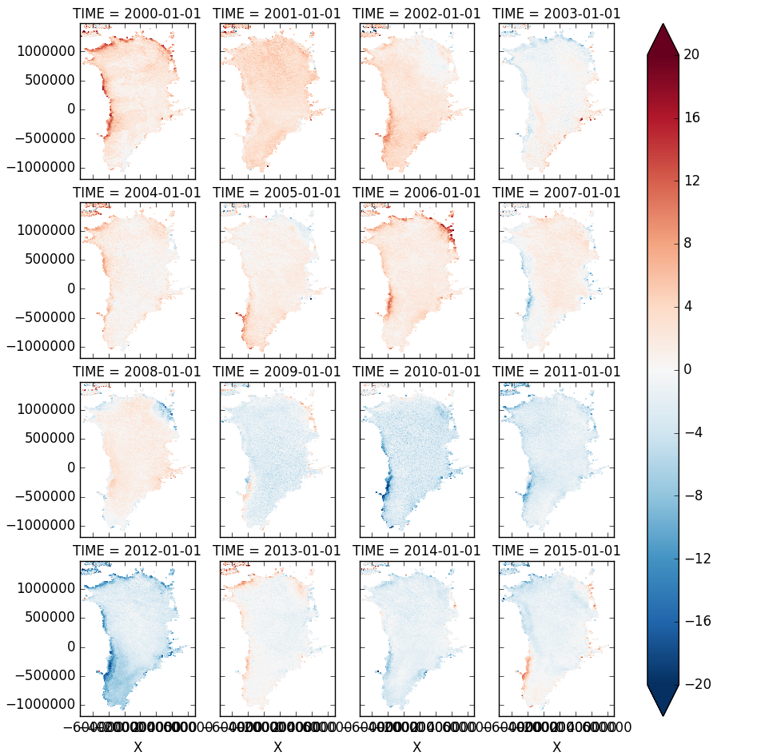
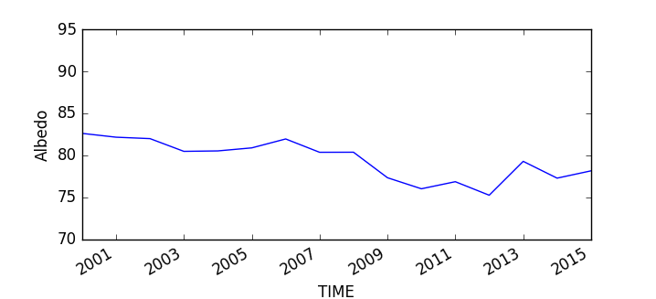

# NetCDF4 in Python the easy way - xarray

Andrew Tedstone, 16 May 2016

I introduced the [xarray](http://xray.readthedocs.io) package, which 'provides an in-memory representation of a netCDF file'.  You can read the (pretty good documentation for more info. 

The major benefit of xarray is its 'automatic' labelling of multi-dimensional data, and the ability to use these labels in any combination to slice and dice your data along every dimension.

Below are just a few ways of slicing/manipulating data, and how to create your own netCDF file.

## Dataset manipulation and querying

One of the most powerful examples I talked about was how to calculate inter-annual anomalies and trends in Greenland Ice Sheet albedo. The example dataset is MOD10A1 data regridded into an Oblique Stereographic projection with the same extent and spatial resolution as the MAR climate model domain.

I have daily maps of albedo stored in annual netCDF files. If we wanted to load in a single year of data we'd do:

```python
modis = xr.open_dataset('albedo_2016.nc')
```

But in this case I'm going to take advantage of xarray's ability to open a whole series of NetCDF files at once. Note that it does not load all the data into memory, it only accesses it when required, so we can load in huge datasets.

```python
modis = xr.open_mfdataset('/media/sf_Data/MOD10A1_MAR/*nc')
```

In the following examples I'll be using a variable named `mar`, this is another netCDF file opened using xarray which contains an ice sheet mask (`mar.MSK`).

First let's query the pixels that are 'good' and on-ice and find only the time points within June-July-August (JJA):

```python
data = modis.Snow_Albedo_Daily_Tile.where(
    (modis.Snow_Albedo_Daily_Tile < 101) &
    (mar.MSK > 99.9) & 
    (modis['TIME.season'] == 'JJA'))
```

Now calculate mean annual JJA albedo and look at the annual anomaly relative to the 2000-2015 mean:

```python
jja_albedo = data.resample('1AS',dim='TIME',how='mean')
anomalies = jja_albedo - jja_albedo.mean(dim='TIME')
anomalies.plot(col='TIME',col_wrap=4)
```



We can compute a time series of average ice sheet albedo. First let's count the number of observations we have to work with in JJA each year:

```python
# Freq 'AS' is year-start
nobs = data.notnull().resample('1AS',dim='TIME',how='sum') 
```

Now let's create a time series using only pixels which have observations for at least 50% of the JJA season each year (46 observations):

```python
jja_ts = jja_albedo.where(nobs > 46).mean(dim=('X','Y'))
jja_ts.plot()
ylim(70,95)
ylabel('Albedo')
```




## Creating a NetCDF file

Here's the basic idea to produce a netCDF file of daily albedo maps for one year:

```python
## Temporal coordinates
times = pd.date_range('2015-04-01', periods=90)
x = #1-D array of x coordinates
y = #1-D array of y coordinates
coords = {'Y':y, 'X':x, 'TIME':times}

# Deal with each band as a separate DataArray in turn
data_arrays = {}

# Iterate through season of daily gridded MODIS acquisitions
di = 0
# Data has dimensions time, y, x
data = np.zeros((90, ny, nx))
# Iterate through the daily data
for d in range(st,en):

    ... snip ...

    # Save to numpy array
    data[di,:,:] = # your 2-D array with dimensions ny, nx
    di += 1

# Convert to data array
da = xr.DataArray(data, coords=[times, y, x], dims=['TIME', 'Y', 'X'])
# Add some meta data
da.attrs['history'] = 'something about processing history'
da.attrs['author'] = 'Your name'

# Create Dataset and save to netCDF
ds = xr.Dataset(da)
ds.to_netcdf('mydata.nc')
# Close file
ds = None
```    